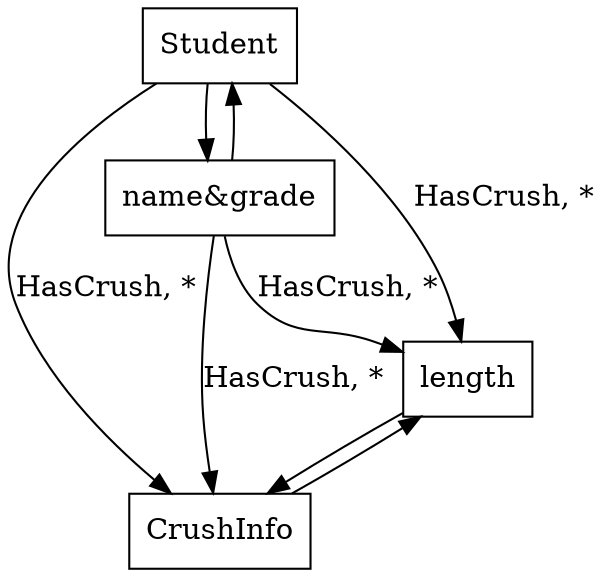
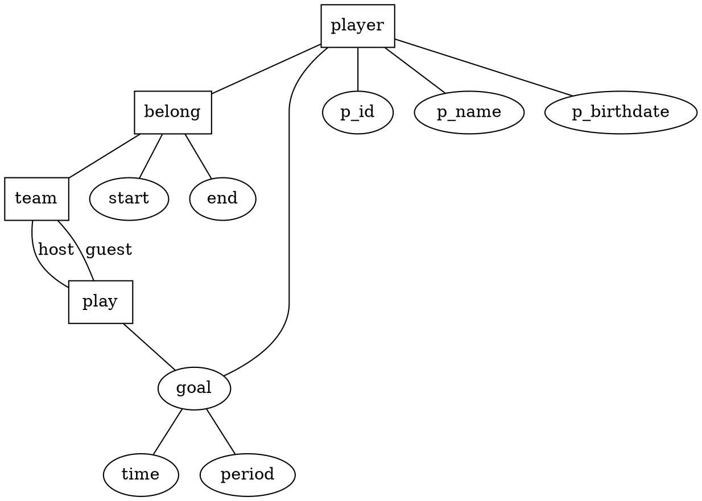

## Question One:

## Question Two:
Overlapping (e.g., Fiction and and Children) and complete (all books are Fiction or Nonfiction).

## Question Three:

team(t_id, t_name)
player(p_id, p_name, p_birthdate)
play(t_id, p_id, p_date, score)
g􏰃oal􏰀(t_id, p􏰁_id, ti􏰄me, 􏰁perio􏰃d)
belong(t_id, p_id, start, end)

